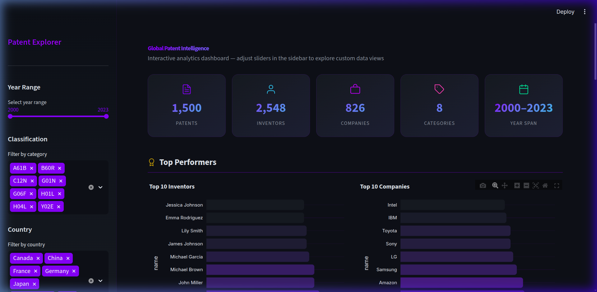
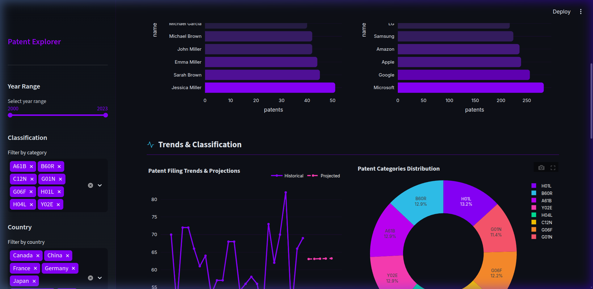
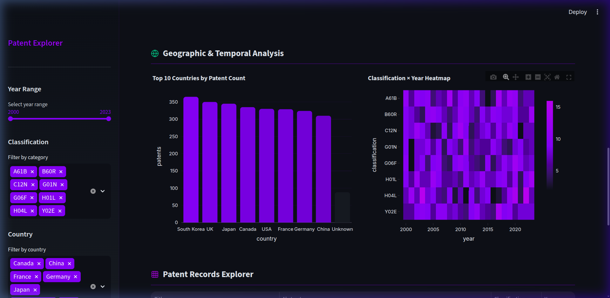

# ⬡ Patent Intelligence Dashboard

A high-performance, interactive data pipeline and analytics dashboard for global patent intelligence.

[](https://share.streamlit.io/j46068742/data-pipeline/main/app.py)
[](https://github.com/joshuakatumba/Data-Pipeline-Assignment)

## 🚀 Overview

This project provides a comprehensive end-to-end data pipeline that extracts, cleans, and analyzes synthetic patent data. The results are presented through a premium, dark-themed Streamlit dashboard.

## 📊 Dashboard Gallery

### Overview & KPIs


### Performance & Trends


### Geographic Analysis & Records


## ✨ Key Features

- **Interactive Sidebar Explorer**: Filter by year range, classifications, countries, and top results.
- **Advanced Trend Analysis**: Real-time filing trends with linear projection modeling.
- **Geographic & Temporal Analysis**: Visualizing patent distribution across countries and years via heatmaps and donut charts.
- **Full-Text Search**: Instant search across patent titles and abstracts.
- **Premium Aesthetics**: Dark glassmorphic design with custom SVG iconography and animated KPI cards.

## 🛠️ Technology Stack

- **Frontend**: Streamlit, Plotly
- **Data Backend**: SQLite3, Pandas, NumPy
- **Pipeline**: Python (Scripts for Extract, Clean, Load, Analyze)

## 🏗️ Getting Started

1. **Setup Environment**:
   ```bash
   pip install -r requirements.txt
   ```

2. **Run Data Pipeline**:
   ```bash
   python scripts/1_extract_data.py
   python scripts/2_clean_data.py
   python scripts/3_load_to_sql.py
   python scripts/4_analyze_and_report.py
   ```

3. **Launch Dashboard**:
   ```bash
   streamlit run app.py
   ```

## 📸 How to Add Screenshots

To make the gallery images above visible on GitHub:
1. Capture three screenshots of your dashboard (Top, Middle, and Bottom sections).
2. Save them exactly as `dashboard_top.png`, `dashboard_middle.png`, and `dashboard_bottom.png` in the `images/` directory.
3. Run `git add .`, `git commit -m "Add dashboard screenshots"`, and `git push`.

GitHub will then automatically render them in the gallery section above.

---
github: https://github.com/joshuakatumba/Data-Pipeline-Assignment  
Deployment link: https://share.streamlit.io/j46068742/data-pipeline/main/app.py